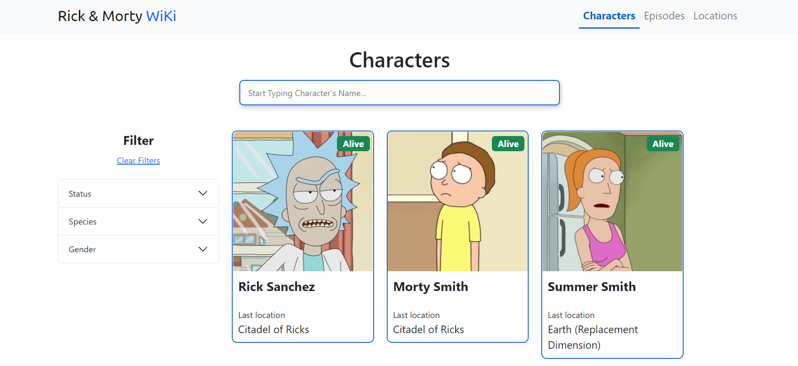
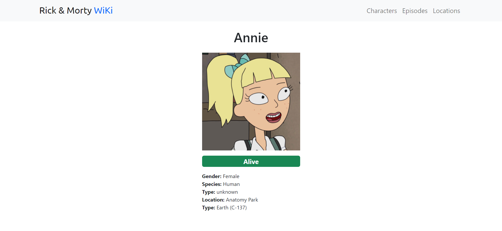

# Rick and Morty WiKi

## Link: https//jixlen999.github.io/rick-and-morty-reactjs/

### The project is made using React js, React hooks (useState, useEffect), React router, Bootstrap. Has responsive version.

### Screenshots:

